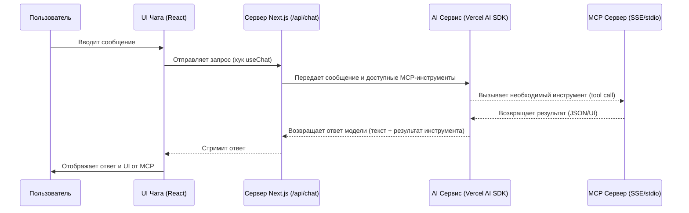

# MCP UI Playground Chat (Форк Scira MCP Chat)

<p align="center">
  Этот проект представляет собой песочницу для чатов с поддержкой <a href="https://github.com/idosal/mcp-ui">MCP-UI</a>. Чат автоматически отображает результаты вызова инструментов (tools) с сервера `mcp-ui` в виде компонентов пользовательского интерфейса и может реагировать на действия, выполняемые с ними. Для получения дополнительной информации обратитесь к <a href="https://idosal.github.io/mcp-ui/">документации</a>.
</p>

<p align="center">
  <a href="#ключевые-особенности"><strong>Особенности</strong></a> •
  <a href="#архитектура-приложения"><strong>Архитектура</strong></a> •
  <a href="#руководство-по-быстрому-старту"><strong>Быстрый старт</strong></a> •
  <a href="#настройка-mcp-серверов"><strong>Настройка MCP</strong></a> •
  <a href="#лицензия"><strong>Лицензия</strong></a>
</p>
<br/>

## Ключевые особенности

- **Поддержка UI в ответах инструментов** с использованием `mcp-ui`!
- **Потоковая передача текста** на базе [AI SDK от Vercel](https://sdk.vercel.ai/docs), что позволяет взаимозаменяемо использовать несколько AI-провайдеров.
- **Полная интеграция с серверами Model Context Protocol (MCP)** для расширения доступных инструментов и возможностей.
- **Несколько типов транспорта MCP** (`SSE` и `stdio`) для подключения к различным поставщикам инструментов.
- **Встроенная интеграция инструментов** для расширения возможностей ИИ.
- **Поддержка моделей-рассуждателей** (reasoning models).
- **Современный и адаптивный UI** на базе компонентов [shadcn/ui](https://ui.shadcn.com/) и [Tailwind CSS](https://tailwindcss.com).
- **Создано с использованием новейшего App Router** в [Next.js](https://nextjs.org).

## Архитектура приложения

Это приложение построено на современной архитектуре, разделяющей логику на клиентскую и серверную части для эффективной работы с AI и MCP.

### Общая схема взаимодействия

Диаграмма ниже иллюстрирует поток данных от интерфейса пользователя до AI-модели и MCP-серверов.



### Управление MCP-серверами (Клиент)

Логика управления MCP-серверами на стороне клиента сосредоточена в `lib/context/mcp-context.tsx`.

- **Хранение:** Конфигурации серверов сохраняются в `localStorage`, что позволяет сохранять их между сессиями.
- **Управление состоянием:** `MCPProvider` предоставляет контекст с состоянием серверов (подключен, отключается и т.д.) и функции для управления ими (`startServer`, `stopServer`).
- **Песочница для `stdio`:** Локальные `stdio` серверы запускаются в изолированной "песочнице" (`sandbox`), которая по сути является проксирующим SSE-сервером. Это важный нюанс для понимания.
- **Как `useMCP()` предоставляет доступ к этому контексту в компонентах.**

### Взаимодействие с AI (Сервер)

Основная логика обработки запросов к AI находится в API-роуте `app/api/chat/route.ts`.

- **Инициализация клиентов:** Перед отправкой запроса к AI, функция `initializeMCPClients` из `lib/mcp-client.ts` инициализирует клиенты для всех активных MCP-серверов.
- **Передача инструментов:** Список доступных инструментов (`tools`), полученных от MCP-серверов, передается в функцию `streamText` из Vercel AI SDK.
- **Обработка вызовов:** AI SDK автоматически обрабатывает `tool_calls` от модели, вызывает соответствующие функции и возвращает `tool_results` обратно модели для генерации финального ответа.

## Руководство по быстрому старту

1.  **Клонируйте репозиторий:**
    ```bash
    git clone https://github.com/how2ai/scira-mcp-ui-chat.git
    cd scira-mcp-ui-chat
    ```

2.  **Установите зависимости:**
    ```bash
    pnpm install
    ```

3.  **Настройте переменные окружения:**
    Создайте файл `.env` в корне проекта. Вам понадобятся ключи для AI-провайдеров и URL для базы данных.
    ```.env
    # Vercel AI SDK Providers
    ANTHROPIC_API_KEY=...
    OPENAI_API_KEY=...
    GOOGLE_GENERATIVE_AI_API_KEY=...
    # ... другие ключи

    # Drizzle / Neon DB
    POSTGRES_URL=...
    ```

4.  **Настройте базу данных:**
    Это приложение использует Drizzle ORM. Выполните команду для применения миграций к вашей базе данных:
    ```bash
    pnpm db:push
    ```

5.  **Запустите приложение:**
    ```bash
    pnpm dev
    ```
    Приложение будет доступно по адресу `http://localhost:3000`.

## Настройка MCP-серверов

Это приложение поддерживает подключение к серверам Model Context Protocol (MCP) для доступа к их инструментам. Вы можете добавлять и управлять MCP-серверами через иконку настроек (⚙️) в интерфейсе чата.

### Добавление MCP-сервера

1.  Нажмите на иконку настроек (⚙️) рядом с выбором модели в интерфейсе чата.
2.  Введите имя для вашего MCP-сервера.
3.  Выберите тип транспорта:
    -   **SSE (Server-Sent Events)**: Для удаленных серверов на базе HTTP.
    -   **stdio (Standard I/O)**: Для локальных серверов, запущенных на той же машине.

#### Конфигурация SSE

1.  Введите URL сервера (например, `https://mcp.example.com/token/sse`).
2.  Нажмите "Add Server".

#### Конфигурация stdio

1.  Введите команду для выполнения (например, `npx`).
2.  Введите аргументы команды (например, `-y @modelcontextprotocol/server-google-maps`).
3.  Нажмите "Add Server".

После добавления нажмите "Use", чтобы активировать сервер для текущей сессии чата.

## Кастомизация и расширение

### Добавление новой AI-модели

Вы можете легко добавить нового AI-провайдера, поддерживаемого Vercel AI SDK.

1.  Установите необходимый пакет: `pnpm install @ai-sdk/your-provider`.
2.  Добавьте провайдер в файл `ai/providers.ts`, следуя существующим примерам.

### Создание собственного MCP-сервера

Вы можете создать свой собственный сервер для расширения возможностей чата.
-   Обратитесь к [официальной документации MCP](https://modelcontextprotocol.io/).
-   Используйте [примеры серверов](https://github.com/model-context-protocol/mcp-servers) как отправную точку.

## Лицензия

Этот проект лицензирован под лицензией Apache 2.0 - подробности смотрите в файле [LICENSE](LICENSE).