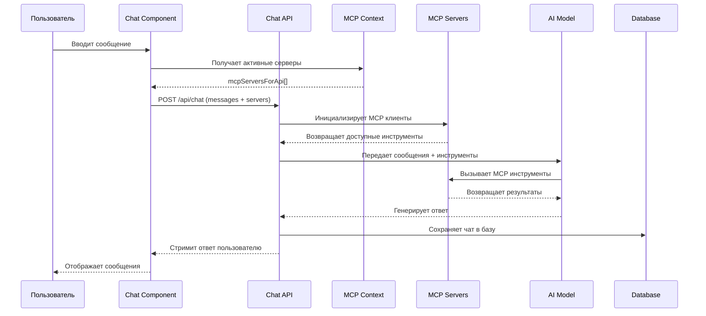

# 🏗️ MCP интеграция - детальная архитектура

Подробное описание того, как Model Context Protocol (MCP) интегрируется с AI моделями в приложении.

## Общий поток данных



## Компоненты системы

### 1. MCP Context (`lib/context/mcp-context.tsx`)

**Отвечает за:**
- Управление жизненным циклом MCP серверов
- Конвертация stdio серверов в SSE через Daytona
- Состояние подключений
- localStorage для персистентности

**Ключевые функции:**

```typescript
interface MCPContextType {
  mcpServers: MCPServer[];              // Все серверы
  selectedMcpServers: string[];         // Активные серверы (ID)
  mcpServersForApi: MCPServerApi[];     // Серверы для API (только connected)
  startServer: (id: string) => Promise<boolean>;
  stopServer: (id: string) => Promise<boolean>;
  updateServerStatus: (id: string, status: ServerStatus) => void;
}
```

**Реактивность данных:**
```typescript
// ИСПРАВЛЕНО: Теперь mcpServersForApi реактивен
const mcpServersForApi = useMemo(() => 
  getActiveServersForApi(), 
  [selectedMcpServers, mcpServers]
);
```

### 2. MCP Client (`lib/mcp-client.ts`)

**Инициализация клиентов:**
```typescript
export async function initializeMCPClients(
  mcpServers: MCPServerConfig[] = []
): Promise<MCPClientManager> {
  let tools = {};
  const mcpClients: any[] = [];

  for (const mcpServer of mcpServers) {
    try {
      // Все серверы обрабатываются как SSE
      const transport = {
        type: 'sse' as const,
        url: mcpServer.url,
        headers: mcpServer.headers?.reduce((acc, header) => {
          if (header.key) acc[header.key] = header.value || '';
          return acc;
        }, {} as Record<string, string>)
      };

      const mcpClient = await createMCPClient({ transport });
      mcpClients.push(mcpClient);

      // Получение инструментов от сервера
      const mcptools = await mcpClient.tools();
      
      console.log(`MCP tools from ${mcpServer.url}:`, Object.keys(mcptools));

      // Объединение всех инструментов
      tools = { ...tools, ...mcptools };
    } catch (error) {
      console.error("Failed to initialize MCP client:", error);
      // Продолжаем с другими серверами
    }
  }

  return { tools, clients: mcpClients, cleanup };
}
```

### 3. Sandbox управление (`lib/mcp-sandbox.ts`, `app/actions.ts`)

**Для stdio серверов:**

1. **Создание sandbox:**
```typescript
const daytona = new Daytona();
const sandbox = await daytona.create({
  resources: { cpu: 2, memory: 4, disk: 5 },
  public: true,
  autoStopInterval: 0,
  envVars: { ...envs }
});
```

2. **Запуск MCP сервера в sandbox:**
```typescript
const mcpServer = await sandbox.process.executeSessionCommand(
  sessionId,
  {
    command: `npx -y supergateway --base-url ${url} --header "x-daytona-preview-token: ${token}" --port 3000 --cors --stdio "${cmd}"`,
    runAsync: true,
  },
  0 // no timeout
);
```

3. **Создание SSE endpoint:**
```typescript
return new McpSandbox(sandbox, sessionId);
// URL: https://sandbox-url/sse
```

### 4. Chat API (`app/api/chat/route.ts`)

**Основной поток:**

```typescript
export async function POST(req: Request) {
  const { messages, mcpServers, userId, chatId } = await req.json();

  // 1. Инициализация MCP клиентов
  const { tools, cleanup } = await initializeMCPClients(mcpServers, req.signal);

  // 2. Передача в AI SDK
  const result = streamText({
    model: model.languageModel(selectedModel),
    messages,
    tools,  // <- MCP инструменты
    maxSteps: 20,
    
    // 3. ИСПРАВЛЕНО: Сохранение в базу данных
    async onFinish({ messages: finalMessages }) {
      await saveChat({
        id: chatId,
        userId,
        messages: finalMessages,
      });
      await cleanup();
    },
  });

  return result.toDataStreamResponse();
}
```

### 5. Chat Component (`components/chat.tsx`)

**ИСПРАВЛЕНО: Загрузка истории чатов:**

```typescript
// Загрузка истории из базы
const { data: chatData } = useQuery({
  queryKey: ['chat', chatId, userId] as const,
  queryFn: async () => {
    const response = await fetch(`/api/chats/${chatId}`, {
      headers: { 'x-user-id': userId }
    });
    return response.json();
  },
  enabled: !!chatId && !!userId,
});

// Конвертация в формат AI SDK
const initialMessages = useMemo(() => {
  if (!chatData?.messages) return [];
  
  return chatData.messages.map(msg => ({
    id: msg.id,
    role: msg.role,
    content: msg.parts?.find(p => p.type === 'text')?.text || '',
    parts: msg.parts
  }));
}, [chatData]);

// Передача MCP серверов в useChat
const { messages, handleSubmit } = useChat({
  initialMessages,
  body: {
    selectedModel,
    mcpServers: mcpServersForApi,  // <- ИСПРАВЛЕНО: Реактивные серверы
    chatId,
    userId,
  },
});
```

## Типы транспорта

### SSE (Server-Sent Events)

**Конфигурация:**
```typescript
interface SSEServer {
  type: 'sse';
  url: string;           // https://server.com/sse
  headers?: KeyValuePair[];
}
```

**Поток:**
```
Client -> SSE Endpoint -> MCP Server
```

**Преимущества:**
- Прямое подключение
- Низкая задержка
- Простая настройка

### stdio (Standard I/O)

**Конфигурация:**
```typescript
interface StdioServer {
  type: 'stdio';
  command: string;       // docker, python, npx
  args: string[];        // ['run', '-i', 'image']
  env?: KeyValuePair[];
}
```

**Поток:**
```
Client -> Daytona Sandbox -> supergateway -> stdio Process -> SSE Endpoint
```

**Преимущества:**
- Изоляция выполнения
- Поддержка любых команд
- Безопасность

## Обработка инструментов

### Получение инструментов

```typescript
// От MCP сервера приходят инструменты
{
  "get_weather": {
    "description": "Get weather for location",
    "inputSchema": {
      "type": "object",
      "properties": {
        "location": {"type": "string"}
      }
    }
  }
}
```

### Передача в AI

```typescript
// AI SDK получает инструменты и может их вызывать
const result = streamText({
  tools: mcpTools,  // <- Инструменты от всех MCP серверов
  // AI автоматически вызывает нужные инструменты
});
```

### Выполнение и результат

```typescript
// AI вызывает инструмент
toolCall: {
  toolName: "get_weather",
  args: { location: "Moscow" }
}

// MCP сервер возвращает результат
toolResult: {
  result: {
    temperature: "15°C",
    condition: "Cloudy"
  }
}
```

## Состояния серверов

### Lifecycle состояний

```typescript
type ServerStatus = 'disconnected' | 'connecting' | 'connected' | 'error';
```

**Переходы состояний:**
```
disconnected -> connecting -> connected
               |           |
               v           v
             error       error
```

### Управление состоянием

```typescript
const updateServerStatus = (serverId: string, status: ServerStatus, errorMessage?: string) => {
  setMcpServers(currentServers => 
    currentServers.map(server => 
      server.id === serverId 
        ? { ...server, status, errorMessage } 
        : server
    )
  );
};
```

## Обработка ошибок

### Уровни обработки ошибок

1. **MCP Client уровень:**
```typescript
try {
  const mcpClient = await createMCPClient({ transport });
  const tools = await mcpClient.tools();
} catch (error) {
  console.error("Failed to initialize MCP client:", error);
  // Продолжаем с другими серверами
}
```

2. **Sandbox уровень:**
```typescript
try {
  const sandbox = await startMcpSandbox({ cmd, envs });
  const url = await sandbox.getUrl();
} catch (error) {
  updateServerStatus(serverId, 'error', error.message);
  return false;
}
```

3. **UI уровень:**
```typescript
useEffect(() => {
  if (error) {
    console.error('Error loading chat:', error);
    toast.error('Failed to load chat');
  }
}, [error]);
```

## Производительность

### Оптимизации

1. **Кэширование инструментов:**
```typescript
// Инструменты кэшируются на время сессии
const { tools } = await initializeMCPClients(mcpServers);
```

2. **Реактивность серверов:**
```typescript
// Только при изменении списка серверов
const mcpServersForApi = useMemo(() => 
  getActiveServersForApi(), 
  [selectedMcpServers, mcpServers]
);
```

3. **Cleanup ресурсов:**
```typescript
// Автоматическая очистка при завершении
req.signal.addEventListener('abort', async () => {
  await cleanup();
});
```

### Мониторинг

**Логи для отладки:**
```typescript
console.log(`MCP tools from ${url}:`, Object.keys(tools));
console.log(`Sandbox created for ${id}, URL: ${url}`);
console.log(`Chat saved with ID: ${chatId}`);
```

## Безопасность

### Изоляция stdio

- Выполнение в Daytona sandbox
- Нет доступа к локальной ФС
- Автоматическая очистка после использования

### Валидация данных

```typescript
// Проверка входных данных
if (!userId) {
  return NextResponse.json({ error: 'User ID required' }, { status: 400 });
}

// Проверка MCP конфигурации
if (!server.url || !server.type) {
  throw new Error('Invalid server configuration');
}
```

### Ограничения ресурсов

```typescript
// Таймауты для MCP операций
const response = await fetch(url, { 
  signal: AbortSignal.timeout(30000) 
});

// Ограничения sandbox
await daytona.create({
  resources: { cpu: 2, memory: 4, disk: 5 },
  autoStopInterval: 0  // Автостоп неактивных
});
```